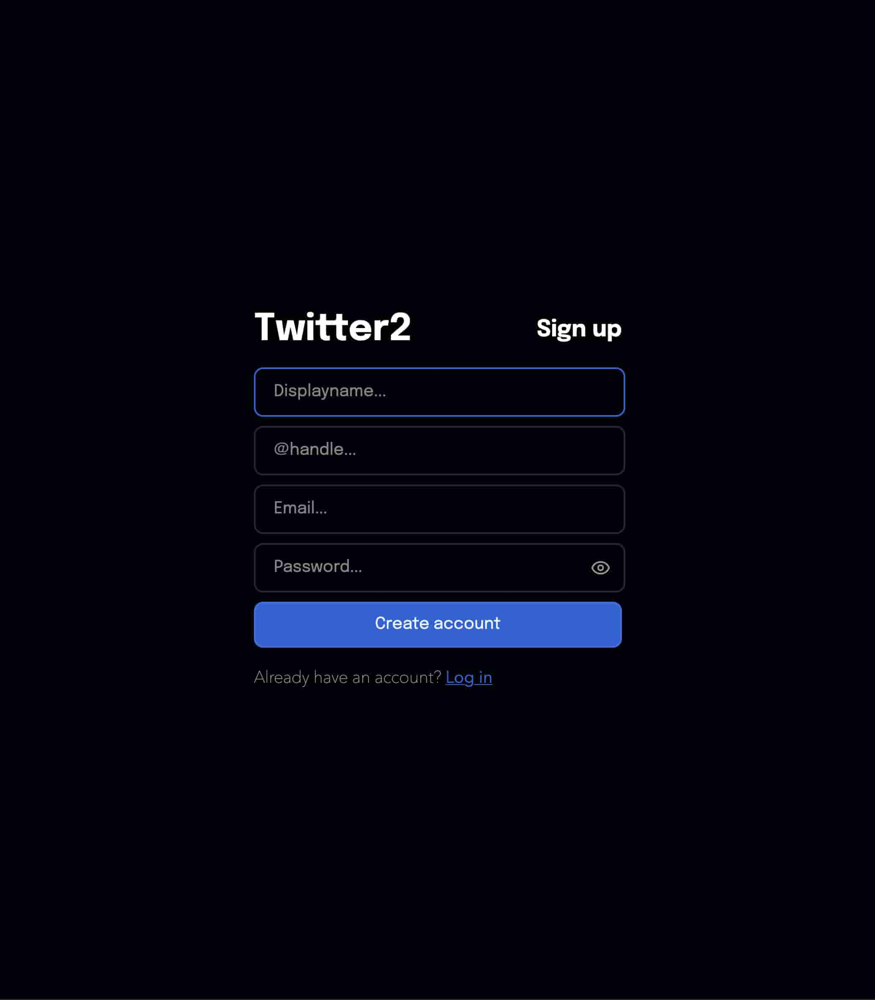
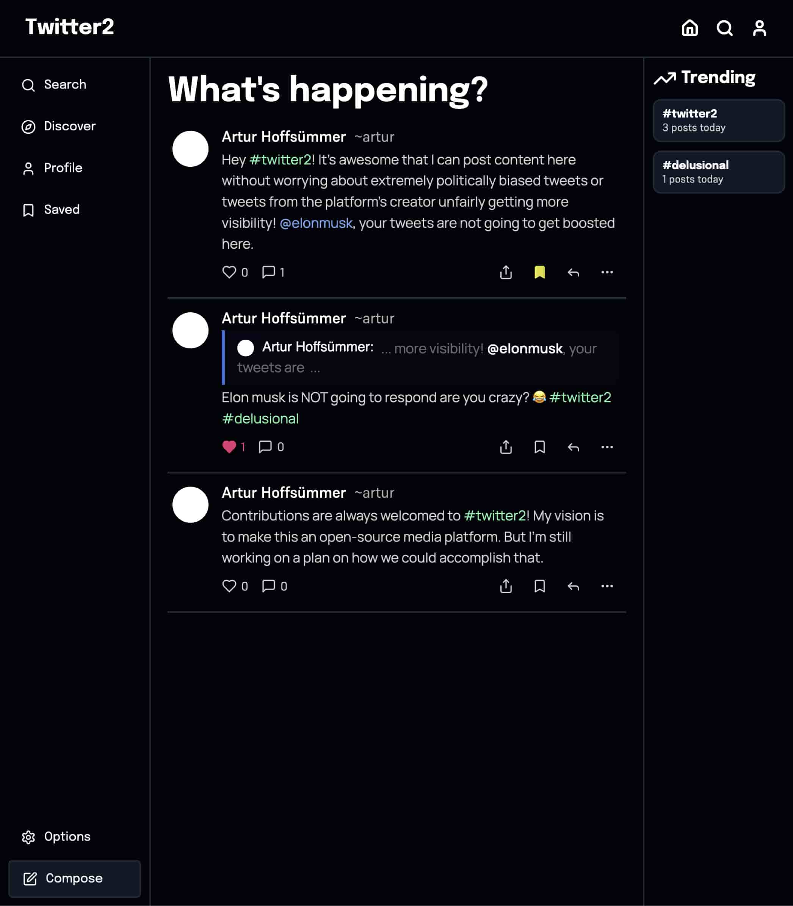
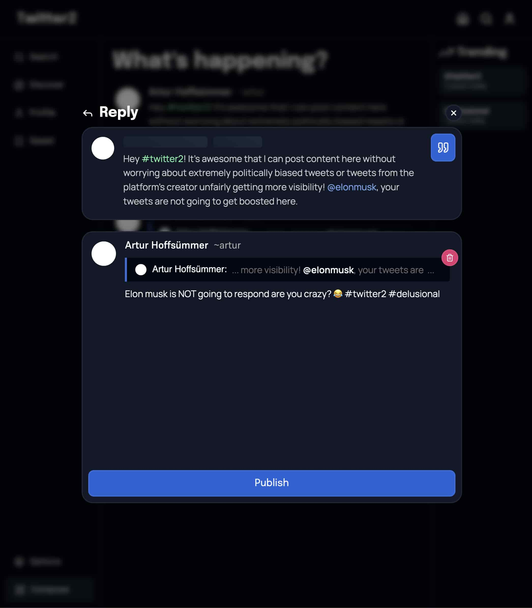
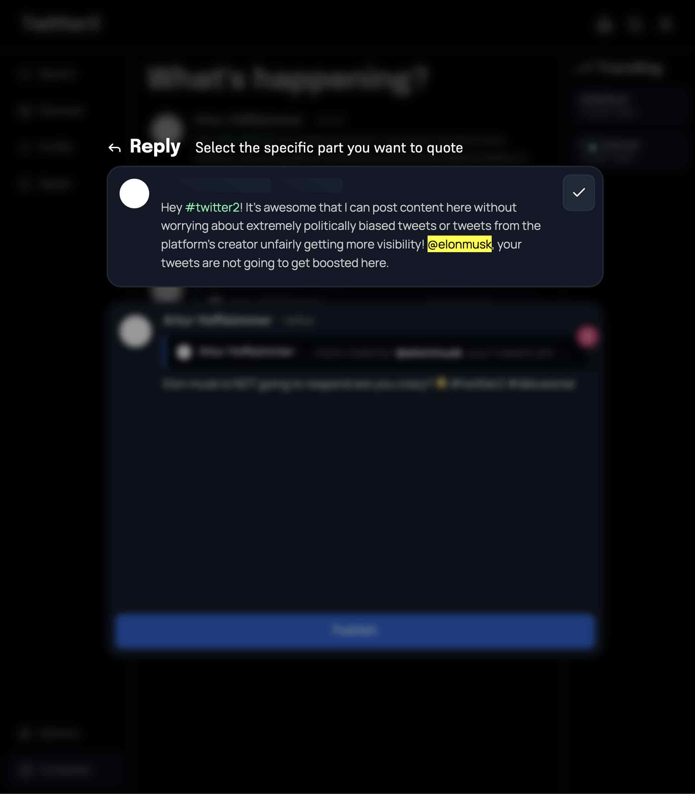

# Twitter2
I started making a clone of twitter (X) recently, because I really didn't like the way the real twitter is heading. It's just about american right wing politics. I would like to create a non-biased media platform, where all accounts have the same requirements for gaining engagement and views. 

### How?
This repo is just the frontend. It's written in `React` using the help of `Typescript` and `Vite`, and is connected to the backend written in Rust using `actix_web`.

### What's the difference between this and x.com?
My goal is not to create something extremely unique just for the sake of it, I want to mimic the feel of the maybe-not-anymore beloved X.com, but whilst still having some new features, like quoting (Referencing a specific part of another post as seen in the "Quote" image below).

Sign up | Homepage
:--:|:--:
 | 

Reply | Quote
:--:|:--:
 | 

### Contributions
Contributions are welcome, and If you'd like to make any huge changes, please open an Issue first. But making a pull request will always work!
